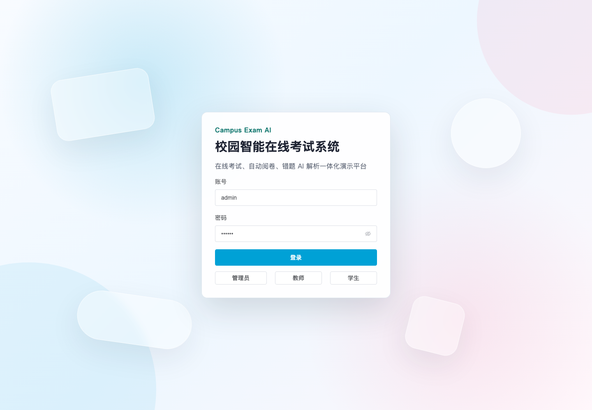
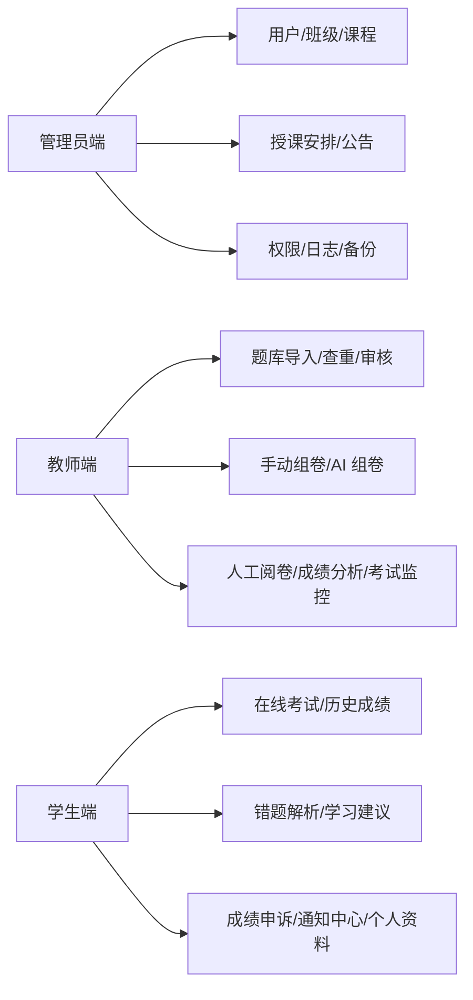
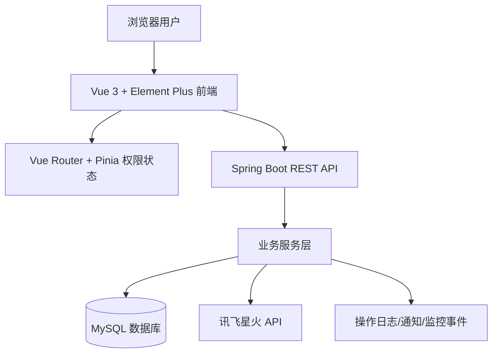
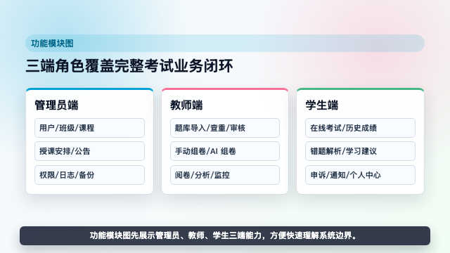
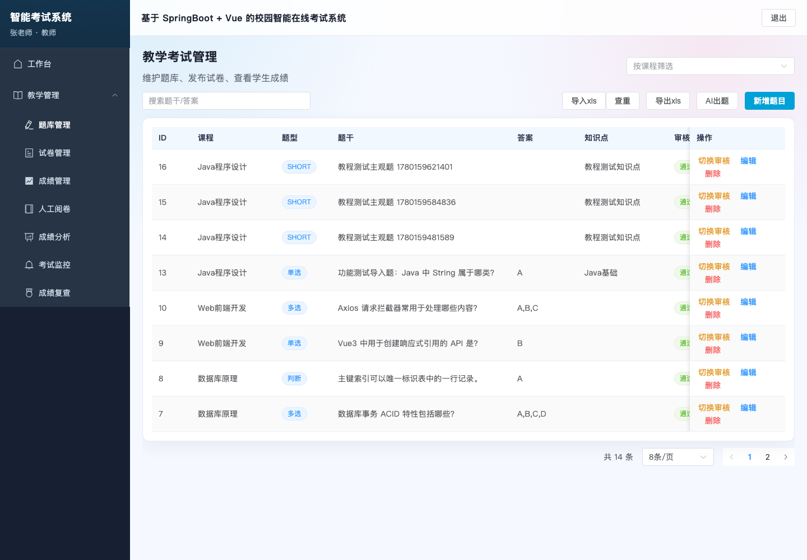
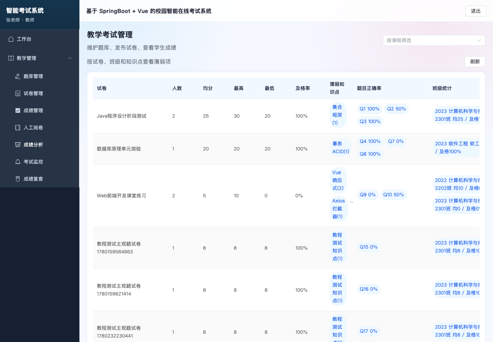
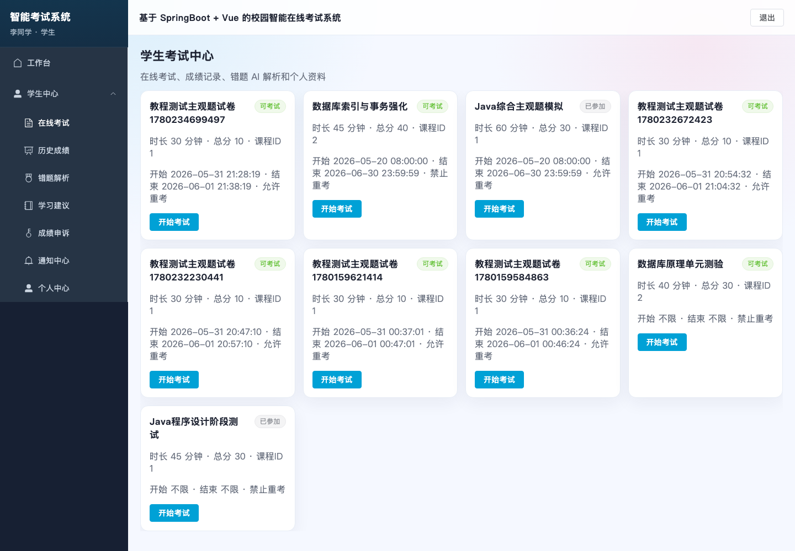
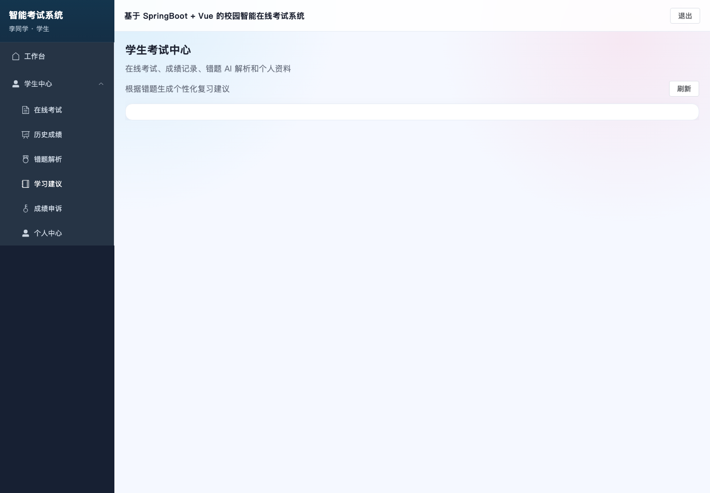

# 校园智能在线考试系统

<!-- open-source-intro-start -->
> **作者寄语**
> 
> 主包是 02 年的，15 岁开始学习计算机，17 岁入行。虽然没有上过大学，但已经帮助很多人顺利毕业和就业。开源这些项目，希望能帮助到你们，也顺便推荐我的论文 AI 工具。如果对主包感兴趣，可以在抖音搜索：迷人闹；如果想学习 AI 编程或需要辅导，也可以联系主包。
> 
> **论文/毕设画图工具推荐：** [毕业论文画图助手](https://gitee.com/chenmin_1_2857135639/bishelunwen) 支持架构图、流程图、ER 图、业务流程图等，适合配合本项目完成论文和答辩材料。
<!-- open-source-intro-end -->

<!-- third-party-api-start -->
## 第三方 API 配置说明

### 讯飞星火（Spark Chat Completions）

- 用途：用于 AI 生成、错题解析、学习建议或智能业务助手等功能。
- 官方接口文档：<https://www.xfyun.cn/doc/spark/Web.html>
- 开放平台/控制台：<https://console.xfyun.cn/>
- 获取方式：注册讯飞开放平台账号，创建或开通星火大模型应用，在应用凭据页获取 APIKey 和 APISecret，按 `APIKey:APISecret` 的格式组合为 APIPassword。
- 环境变量：`SPARK_API_PASSWORD=your_api_key:your_api_secret`，可选 `SPARK_API_URL=https://spark-api-open.xf-yun.com/v1/chat/completions`、`SPARK_MODEL=generalv3`。

> 注意：不要把真实 API Key、Secret、Token 提交到代码仓库。开源示例只保留占位值，本地运行时再写入 `.env` 或系统环境变量。
<!-- third-party-api-end -->


一个面向毕业设计、课程设计和二次开发的校园智能在线考试系统。项目基于 Spring Boot 3、Vue 3、MyBatis-Plus、MySQL、Element Plus 和讯飞星火 API，实现管理员、教师、学生三端完整考试业务闭环。



## 功能模块图



## 系统框架图



## 功能亮点

- 管理员：用户、课程、班级、授课、公告、权限、操作日志、备份恢复记录。
- 教师：题库维护、Excel 批量导入、题目查重、题目审核、手动组卷、AI 智能组卷、成绩管理、人工阅卷、成绩分析、考试监控、成绩复查。
- 学生：在线考试、倒计时、主观题作答、自动阅卷、历史成绩、AI 错题解析、AI 学习建议、成绩申诉、通知中心。
- 考试控制：考试开始/结束时间、防重复考试、允许/禁止重考、超时自动提交、切屏/失焦监控。
- AI 能力：AI 出题、AI 组卷、AI 错题解析、AI 个性化复习建议，接口失败时提供本地兜底。
- 开源友好：内置完整初始化 SQL、完整教程、截图素材、贡献指南和安全说明。

完整功能说明见：[docs/功能清单.md](docs/功能清单.md)  
系统使用教程见：[教程.html](教程.html)

## 演示视频

完整功能演示视频见：[docs/campus-exam-ai-full-demo.mp4](docs/campus-exam-ai-full-demo.mp4)

[](docs/campus-exam-ai-full-demo.mp4)

## 在线截图

| 教师题库 | 成绩分析 |
| --- | --- |
|  |  |

| 学生考试 | 学习建议 |
| --- | --- |
|  |  |

## 技术栈

| 模块 | 技术 |
| --- | --- |
| 后端 | Spring Boot 3、Java 17、MyBatis-Plus、MySQL |
| 前端 | Vue 3、Vite、Pinia、Vue Router、Element Plus |
| AI | 讯飞星火 Chat Completions API |
| 文档 | HTML 教程、Markdown 功能清单、自动化截图 |

讯飞星火 API 申请与接口信息：<https://xinghuo.xfyun.cn/sparkapi?ch=xhapi-bytg-jh26&bd_vid=7803253300065052415>

## 目录结构

```text
backend/                         Spring Boot 后端
  src/main/java/com/campus/exam/
    controller/                  接口控制器
    service/                     业务逻辑
    entity/                      数据实体
    mapper/                      MyBatis-Plus Mapper
frontend/                        Vue 3 前端
  src/views/                     管理员、教师、学生、工作台页面
sql/
  campus_exam_ai.sql             完整数据库初始化脚本
docs/
  功能清单.md                    功能模块清单
  tutorial-assets/               教程截图、测试报告、Excel 模板
scripts/
  e2e_test_and_screenshots.mjs   自动化测试和截图脚本
教程.html                         完整系统使用教程
```

## 快速启动

### 1. 初始化数据库

```bash
mysql -uroot -proot < sql/campus_exam_ai.sql
```

该脚本会重建 `campus_exam_ai` 数据库并写入演示数据；已有数据时请先备份。

### 2. 配置后端

推荐使用环境变量：

```bash
export DB_URL="jdbc:mysql://localhost:3306/campus_exam_ai?useUnicode=true&characterEncoding=utf8&serverTimezone=Asia/Shanghai&allowPublicKeyRetrieval=true&useSSL=false"
export DB_USERNAME="root"
export DB_PASSWORD="root"
export SPARK_API_PASSWORD="your_spark_api_password"
```

也可以复制示例配置：

```bash
cp backend/src/main/resources/application-example.yml backend/src/main/resources/application-local.yml
```

`application-local.yml` 已加入 `.gitignore`，请不要提交真实密钥。

讯飞星火 API 控制台地址：<https://xinghuo.xfyun.cn/sparkapi?ch=xhapi-bytg-jh26&bd_vid=7803253300065052415>

### 3. 启动后端

```bash
cd backend
mvn spring-boot:run
```

后端默认端口：`8080`。

### 4. 启动前端

```bash
cd frontend
npm install
npm run dev
```

前端默认端口：`5173`。

如果后端不是默认地址，可以指定代理：

```bash
VITE_API_PROXY=http://localhost:18082 npm run dev -- --port 5176
```

## 演示账号

| 角色 | 账号 | 密码 |
| --- | --- | --- |
| 管理员 | `admin` | `123456` |
| 教师 | `teacher` | `123456` |
| 学生 | `student` | `123456` |

## 测试

后端构建：

```bash
cd backend
mvn -q -DskipTests package
```

前端构建：

```bash
cd frontend
npm run build
```

自动化冒烟测试和截图：

```bash
node scripts/e2e_test_and_screenshots.mjs
```

测试报告会输出到：

```text
docs/tutorial-assets/test-report.json
```

## 相关项目推荐

写毕业论文时，经常还需要画系统架构图、流程图、ER 图、业务流程图。可以配合这个画图助手使用：

**毕业论文画图助手：** [查看项目](https://gitee.com/chenmin_1_2857135639/bishelunwen)

这个考试系统适合作为业务系统主体，画图助手适合辅助完成论文中的系统设计图、流程图和结构图，两者搭配更方便做毕业设计材料整理。

## 开源说明

- 开源协议：MIT，见 [LICENSE](LICENSE)。
- 贡献说明：见 [CONTRIBUTING.md](CONTRIBUTING.md)。
- 安全说明：见 [SECURITY.md](SECURITY.md)。
- 提交代码前请确认未包含真实数据库密码、AI Key、学生隐私数据和考试真实题库。

## 免责声明

本项目主要用于学习、毕业设计和二次开发演示。生产环境使用前，请补充更严格的权限审计、数据备份、登录风控、考试防作弊和隐私保护策略。
